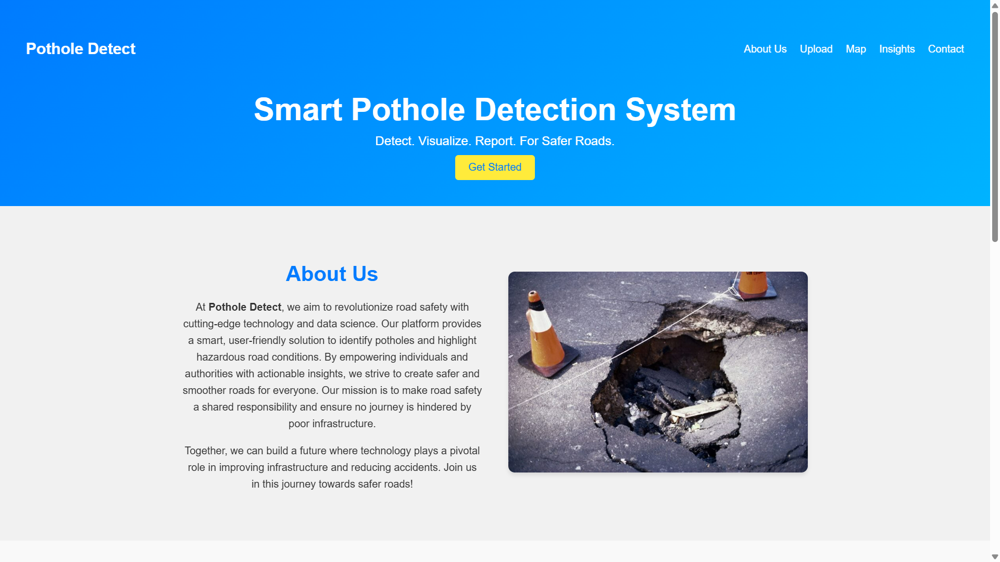
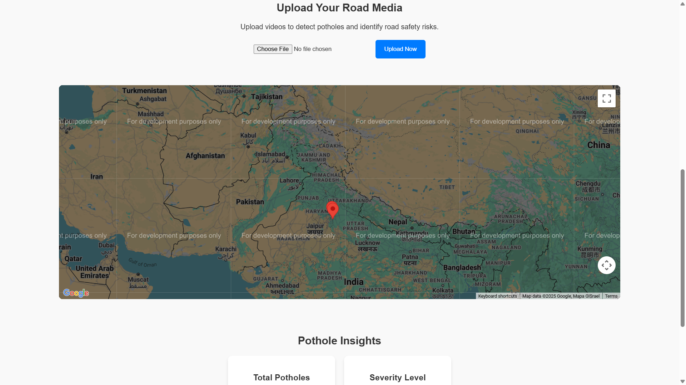

# Pothole Detection and Tracking System  

An AI-powered solution designed to detect, track, and geotag potholes using video inputs. This project leverages the YOLO object detection model to analyze video frames and extract GPS metadata for accurate geolocation of potholes. The system aims to assist road maintenance teams by automating the identification of road damage, enhancing safety, and streamlining repair workflows.  

---

## Screenshots

- **Main Interface**:
  

- **Uploading section**:
  

---

## Features  

- **Pothole Detection**: Detect potholes in video frames using a YOLO-based object detection model.  
- **Tracking**: Assign unique IDs to detected potholes and track them across video frames.  
- **Geotagging**: Extract GPS metadata from videos to associate potholes with real-world locations.  
- **Video Annotation**: Annotate video outputs with bounding boxes, confidence scores, and unique IDs for visual insights.  
- **Scalable Deployment**: Compatible with dashcams, drones, or other video input sources.  

---

## Project Objective  

The primary objective of this project is to provide a robust, AI-driven pothole detection and tracking system that enables:  
1. Real-time or post-event analysis of road conditions.  
2. Integration with mapping tools for geotagged pothole locations.  
3. Improved road safety and reduced maintenance costs by identifying and prioritizing pothole repairs.  

---

## Installation  

1. Clone the repository:  
   ```bash
   git clone https://github.com/your-username/pothole-detection.git
   cd pothole-detection
   ```  

2. Install dependencies:  
   ```bash
   pip install -r requirements.txt
   ```  

3. Download the trained YOLO model weights and place them in the appropriate directory:  
   ```plaintext
   /path/to/weights/best.pt
   ```  

4. Add your Google Map API in the templates/index.html:
    ```plaintext
    <script src="https://maps.googleapis.com/maps/api/js?key=YOUR_API_KEY" defer></script>
    ```

---

## File Structure  

```plaintext
pothole-detection/
├── app.py       # Main script for video processing
├── requirements.txt       # List of required Python packages
├── Model/               # Directory for YOLO model weights
└── README.md              # Project documentation
```  

---

## Future Scope  

1. **Enhanced Model Accuracy**: Train on diverse datasets to improve performance in different environments.  
2. **Real-Time Processing**: Optimize for live monitoring applications.  
3. **Integration**: Seamlessly integrate with mapping tools and dashboards for maintenance planning.  
4. **Predictive Analytics**: Analyze historical data for proactive road maintenance insights.  

---

## Contributing  

Contributions are welcome! Please fork the repository, make your changes, and submit a pull request.  
